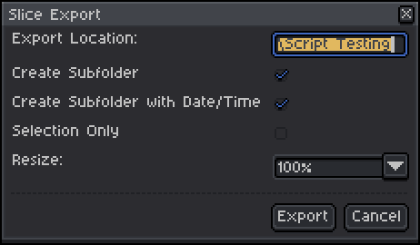

# slice utility

This Aseprite extension was created to streamline creating individual assets from a single large canvas.

  

## Features
- Export All Slices: Exports all defined slices to a specified folder.
	- By default creates a subfolder with origin sprite name and datetime. (can be disabled)
	- If Slice User Data is defined it will be used as a sub folder (e.g. item/block)
	- Options:
		- Create Subfolder: boolean
		- Create Subfolder with Date/Time: boolean
		- Selection Only: boolean
		- Resize: dropdown { "100%", "200%", "300%", "400%", "500%", "600%", "700%", "800%", "900%", "1000%"}
	- Will prompt with decision if output folder already exists

- Update Slice Data: Updates slice data within the selected area
	- Color
	- User Data