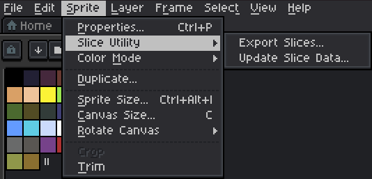
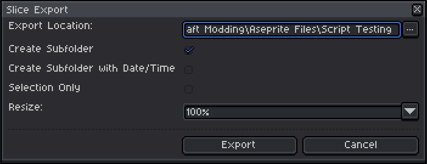
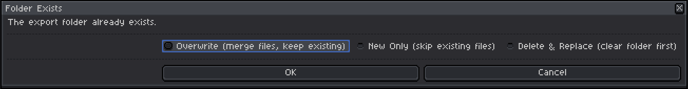
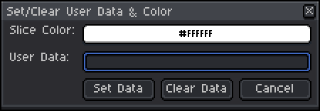

# slice utility

An Aseprite extension for exporting individual assets from a single large canvas.

## Why This Exists

While developing Minecrtaft mods, I'd prototype item and block sprites together on a large canvas to keep the style consistent across assets. The problem was getting them out; each sprite had to be manually cropped into its own file and exported individually. It was slow, repetitive, and a pain in the hands.

## Features

Adds a **Slice Utility** group to the **Sprite** dropdown with two commands:

**Export Slices...** exports all defined slices to a specified folder. If slice User Data is set, it is used as a subfolder path (e.g. `item/block`). If the output folder already exists, you'll be prompted before anything is overwritten.

Export options:
- **Create Subfolder** creates a subfolder named after the origin sprite
- **Create Subfolder with Date/Time** appends a datetime stamp to the subfolder name
- **Selection Only** limits export to slices within the active selection. Enabled by default when a selection is active; a `(*)` in the label indicates this. Can be manually overridden.
- **Resize** scales output from 100% to 1000% in 100% increments

**Update Slice Data** updates the **color** and **User Data** of all slices within the selected area.

## Keyboard Shortcuts

- **Ctrl+Shift+E** — Export Slices
- **Ctrl+Shift+W** — Update Slice Data

## Duplicate Slice Handling

When multiple slices share the same name or subfolder, each exported file is automatically given a unique name by appending the lowest available increment (e.g. `_1`, `_2`). No slices are skipped or silently overwritten.

For full details see [Duplicate Slice Handling Documentation](docs/duplicate-slice-handling.md).

## Screenshots

**Menu Group**

  

**Export Slices**

  

  

**Update Slice Data**

  

